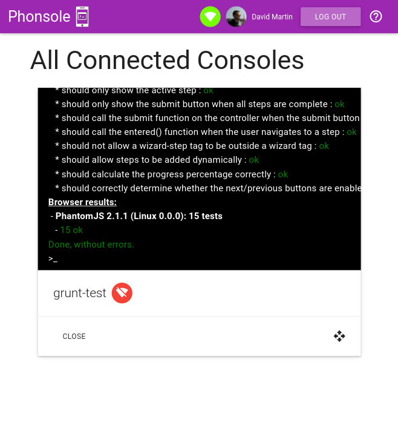

# phonsole-client

The client for the phonsole application.

## Deploying

To deploy the client:

* Clone the repo
* Install [leiningen](http://leiningen.org/)
* Run `lein do resource, cljsbuild once prod`
* Run `./scss.sh` to compile the scss
* Host the files in `/resources/public` somewhere

## Debugging

You can use figwheel to debug the client. 

* Install [local-web-server](https://www.npmjs.com/package/local-web-server)
* Run `lein do resource, figwheel`
* In a separate console, run `./scss.sh -w`
* In the `/resources/public` directory, run `ws --spa index.html`
* The site should now be running at http://localhost:8000
* To prevent the service worker caching any assets, make sure "Disable cache" is checked in chrome dev tools.

## License

Distributed under the GPL V3 license.
